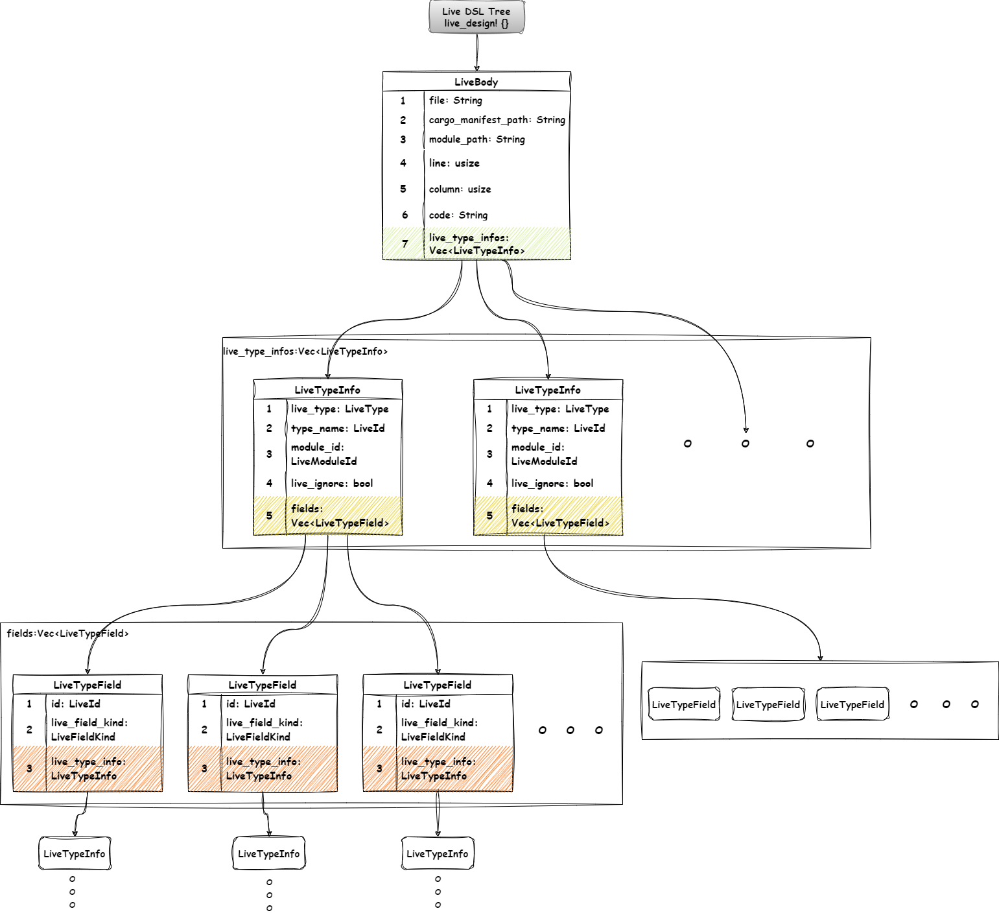

# my-makepad-learning-journal

Record some contents during the learning process for convenient viewing later.

# Graphics

## makepad live life cycle

## makepad live DSL Tree

In this “[macro_expand/LiveBody](LiveBody)” folder, the LiveBody data of all components in the widget crate are displayed.

[LiveBody]: ./macro_expand/LiveBody/